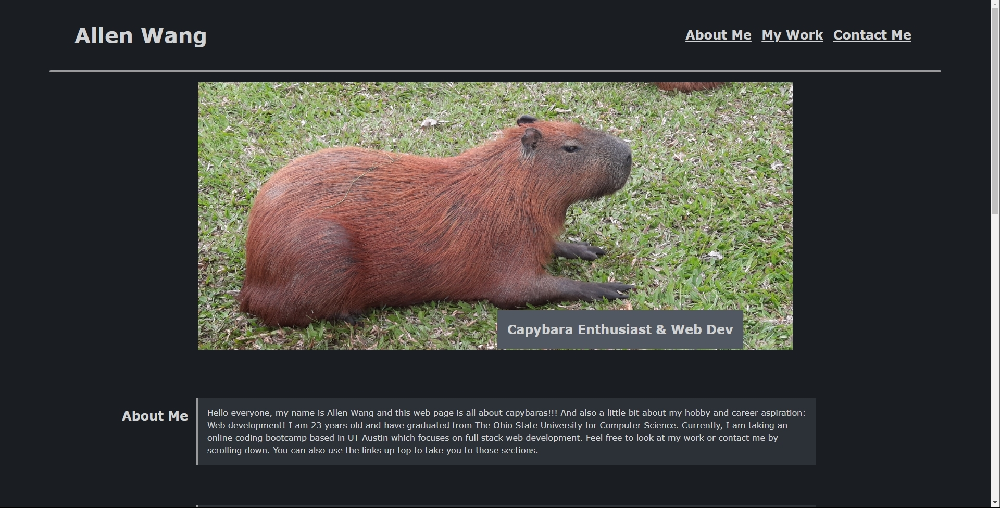

# Advanced-CSS
Challenge 2 for UTA FSF Bootcamp

## Description
The problem in Chalenge Two is to create a webpage using HTML and CSS that displays a portfolio. This project focused on using more advanced CSS strategies to make the webpage more aesthetically pleasing and accessible.

## Preview

## Usage
To view the refactored webpage, go to https://allenwang1999.github.io/Advanced-CSS using your browser.

## License
MIT License; refer to the <a href="LICENSE">LICENSE</a> file in the repo.